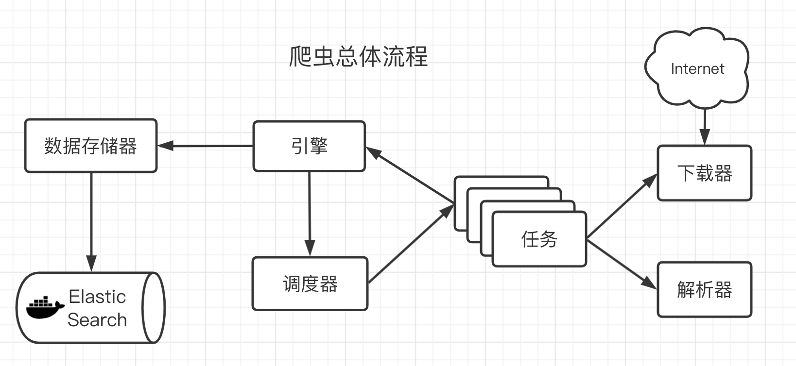
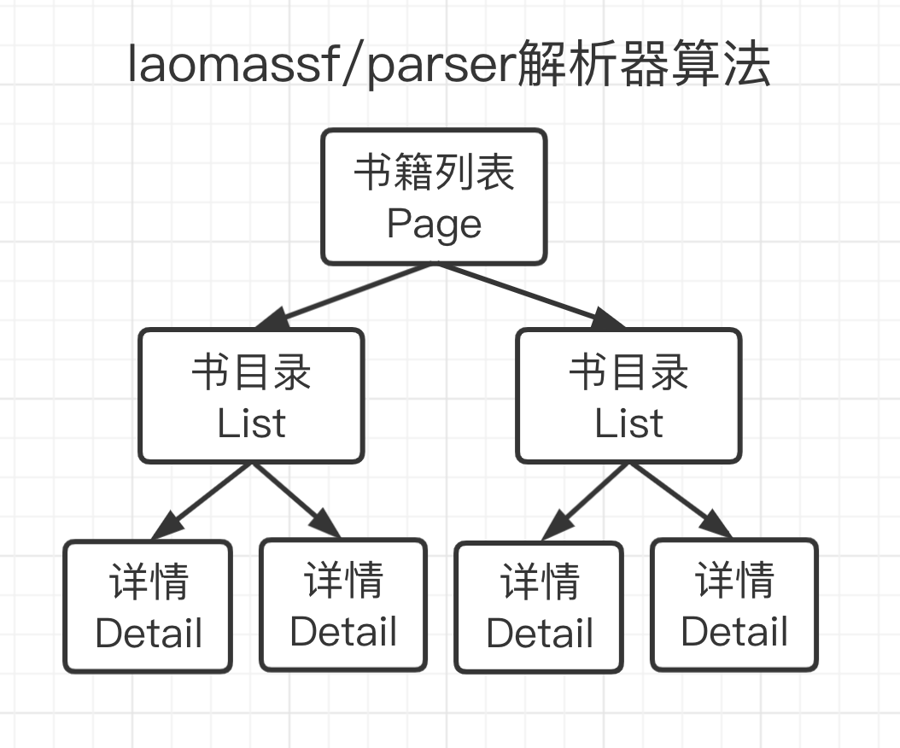
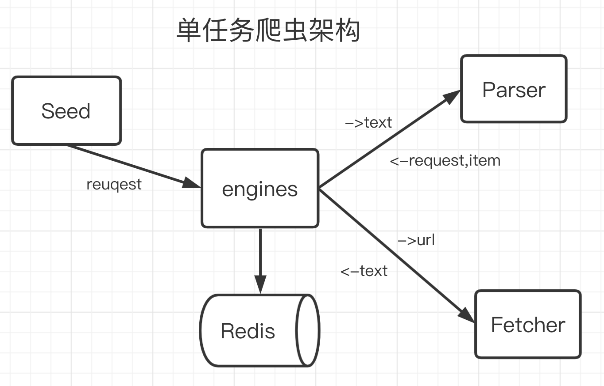
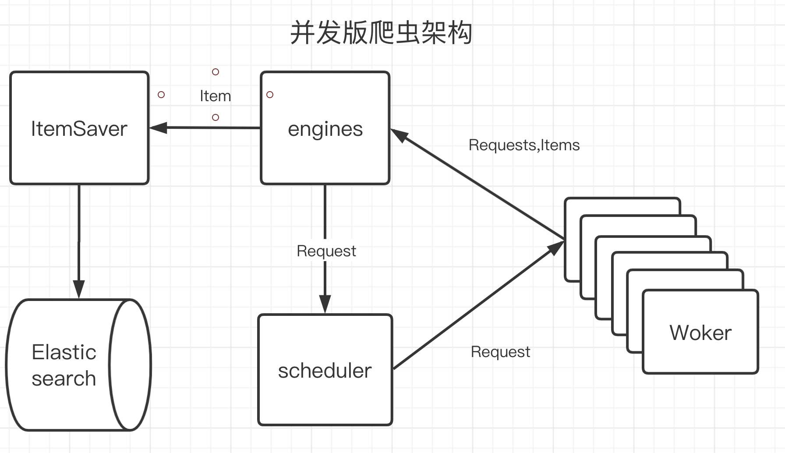
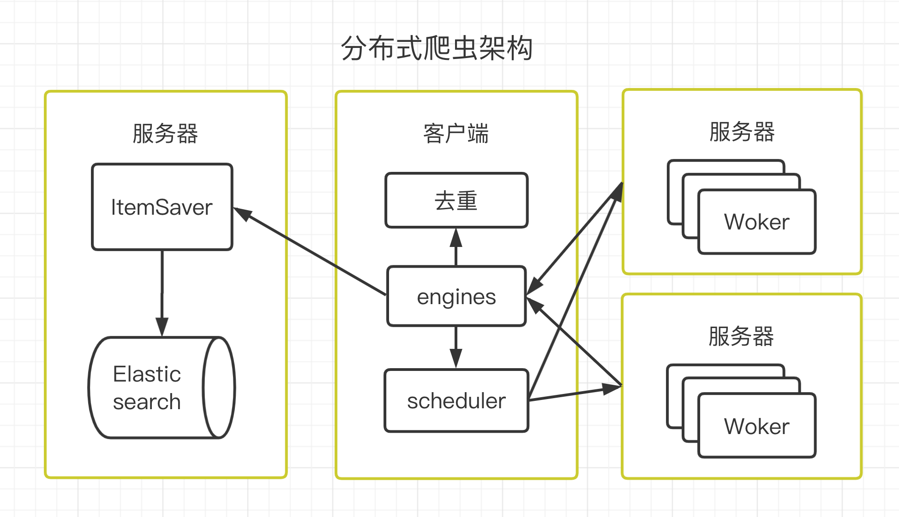

# spiders

```c
└── singleTaskCrawfer       #单机版
├── concurrencyCrawfer      #并发版
├── distributedCrawfer      #分布式并发版
```


# description
爬虫的总体算法





# using
启动elasticsearch服务
```c
docker run -p 9200:9200 elasticsearch:6.8.12
```

启动存储服务
```c
go run distributed/dao/server/iteamsaver.go -port 1234
```

启动多个worker
```c
go run distributed/worker/server/worker.go -port 9001
go run distributed/worker/server/worker.go -port 9002
```

启动调度器
```c
go run main.go -itemsaver_host=":1234" -worker_hosts=":9001,:9002"
```
运行示例
